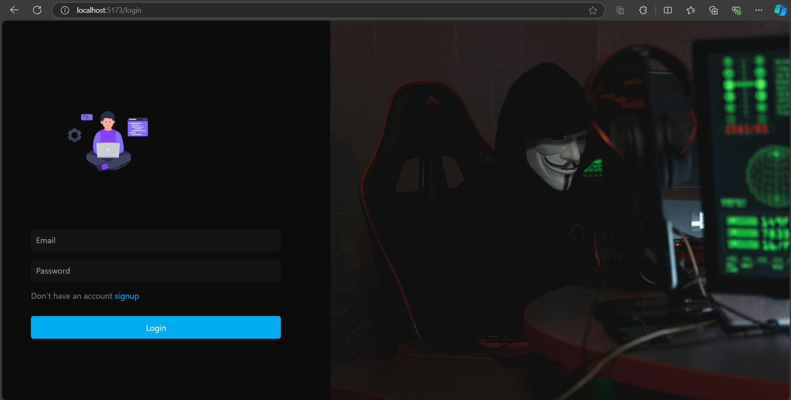

# Online IDE

An online Integrated Development Environment (IDE) for writing, running, and saving **HTML**, **CSS**, and **JavaScript** code. This IDE is designed for web developers to get instant feedback with a live preview feature. It also includes user authentication, code saving, and both **grid** and **list** views for managing saved projects.

## Features

- **HTML, CSS, JavaScript Code Editor**: Edit code with an integrated code editor.
- **Live Preview**: Instant feedback on code output.
- **User Authentication**: Register and log in securely.
- **Save and Retrieve Code**: Save your code snippets to a MongoDB database.
- **Grid/List View**: View your saved projects in grid or list format.
- **Responsive UI**: Mobile and desktop friendly.

## Technologies Used

### Frontend:
- **React.js**: UI library for building interactive user interfaces.
- **Tailwind CSS**: Utility-first CSS framework for styling.
- **Monaco Editor**: Code editor for writing HTML, CSS, and JavaScript.
- **React Router**: For managing different routes in the application.
- **React Hot Toast**: For notifications.

### Backend:
- **Express.js**: Web framework for Node.js.
- **MongoDB & Mongoose**: NoSQL database and object data modeling.
- **JWT (JSON Web Tokens)**: For user authentication.
- **Bcrypt.js**: For secure password hashing.

## Installation

### Prerequisites

- **Node.js** (v14+)
- **MongoDB** (Local or Atlas)

### Backend Setup

1. **Clone the repository**:
   ```bash
   git clone https://github.com/inevitable-ank/Online_IDE.git
   cd Online_IDE

2. **Install backend dependencies:**:
    cd backend
    npm install

3. **Create a .env file in the backend folder and add the following:**
    MONGO_URI=<your-mongodb-uri>
    JWT_SECRET=<your-secret-key>
    PORT=5000

4. **Start the backend:**
    npm start

### Frontend Setup

1. **Navigate to the frontend:**
    cd ../frontend
    
2. **Install frontend dependencies:**
    npm install

3. **Start the frontend:**
    npm run dev

4. **Access the application:**
Open http://localhost:3000 in your browser.

### Usage

1. **Sign Up / Log In:** Register a new account or log in using your credentials.
2. **Code Editor:** Write HTML, CSS, or JavaScript code in the editor.
3. **Live Preview:** See the output of your code instantly in the preview pane.
4. **Save Code:** Save your code snippets to your account.
5. **Grid/List View:** Toggle between grid and list views to manage your saved code snippets.

## Screenshots

### Sign Up


### Login


### Grid View


### List View


### Editor View


Code Editor View

Live Preview

Grid/List View of Saved Projects

### Contributing
Contributions are welcome! To contribute:

1. Fork the repository.
2. Create a new feature branch (git checkout -b feature/new-feature).
3. Commit your changes (git commit -m 'Add new feature').
4. Push the branch (git push origin feature/new-feature).
5. Open a Pull Request.